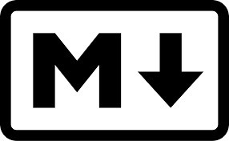

# Introducción a Markdown

--
## ¿Qué es Markdown?
Markdown es un lenguaje de marcado ligero que permite crear texto con formato de manera simple y legible. Su sintaxis usa caracteres comunes para estructurar títulos, listas, enlaces, imágenes y bloques de código sin necesidad de herramientas complejas.

---
## ¿Para qué sirve?
Markdown facilita la redacción y edición de documentos que pueden convertirse fácilmente a HTML u otros formatos digitales. Es ideal para crear contenido claro, estructurado y compatible con múltiples plataformas y sistemas colaborativos.

---

## Extensiones

Las extensiones en Markdown permiten ampliar sus funciones básicas, añadiendo soporte para tablas, listas de tareas, diagramas de flujo, resaltado de sintaxis y más. Estas mejoras dependen del motor o plataforma donde se utilice, y en algunos casos requieren complementos adicionales o conversión previa a imagen.

**Algunas de esa es:**
* [Markdown Preview Enhanced](https://marketplace.visualstudio.com/items?itemName=shd101wyy.markdown-preview-enhanced)
---

