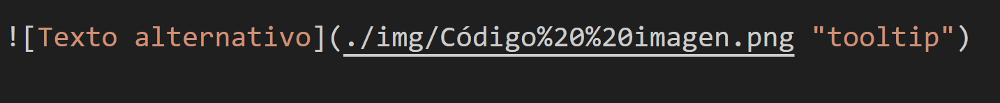

#  Sintaxis básica de MarkDown
Lenguaje sencillo que usa símbolos especiales para darle formato al texto sin complicaciones. Con comandos básicos como # para títulos, * para énfasis, listas con - o números, y bloques de código con `.
## Títulos

    # Título nivel 1
    ## Título nivel 2
    ### Título nivel 3
    #### Título nivel 4
    ##### Título nivel 5
    ###### Título nivel 6

 
 ##  Énfasis (cursiva y negrita)

Texto en cursiva o Texto en cursiva

**Texto en negrita**

   
    **Texto en negrita**

*Texto italic*

    *Texto italic*

~~Texto Tachado~~

    ~~Texto Tachado~~


## Listas
**Lista con guiones:**
* ítem 1

<pre >
* ítem 1
</pre>

**Lista numeradas:**

1. Primer ítem
<pre>
1. Primer ítem 
</pre>

## Código
**Para código en línea:**

`Código`

    `Código`

**Para bloques de código:**

Ejemplo con JavaScript:

```js
console.log("Hola Mundo");
```
<pre>
```js
console.log("Hola Mundo");
```
</pre>

## Imagenes y Videos 
**Imagen:**


**Imagen con tooltip:**



## Línea separadora
Para una línea sola se pone tres guiones (---) o tres asteriscos (***) o tres guiones bajos (___), siempre en una línea aparte, sin espacios ni texto al lado.

**Texto arriba**

---
**Texto abajo**

    **Texto arriba**

    --- 
    **Texto abajo**


