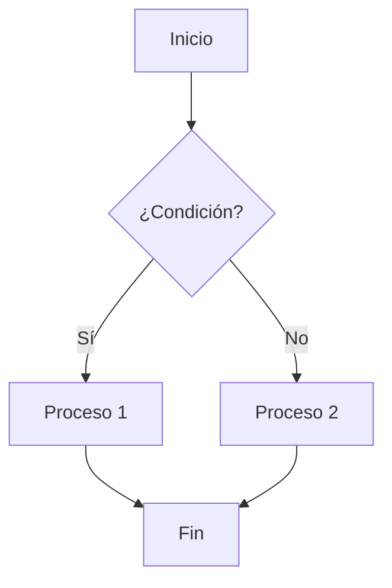
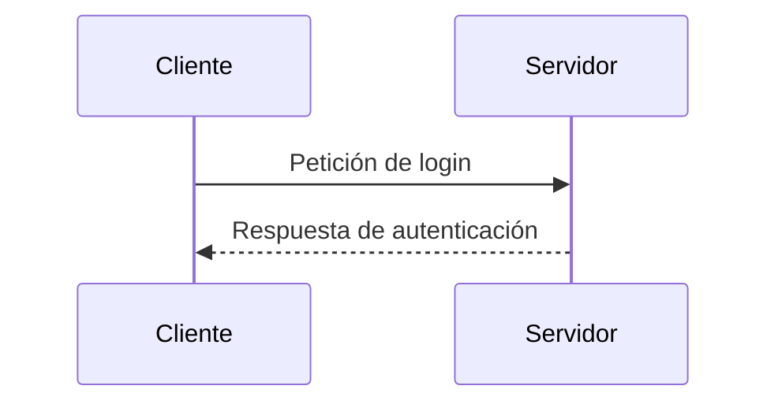
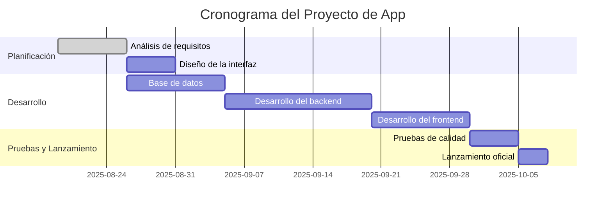

# Sintaxis avanzada de Markdow

Además de lo básico, Markdown ofrece funciones más avanzadas que ayudan a organizar y enriquecer los documentos:

## Tablas
Permiten organizar datos en filas y columnas con una sintaxis sencilla:

| Columna 1 | Columna 2 |
| --------- | --------- |
| Dato 1    | Dato 2    |
| Dato 3    | Dato 4    |

    | Columna 1 | Columna 2 |
    | --------- | --------- |
    | Dato 1    | Dato 2    |
    | Dato 3    | Dato 4    |

---

## Alertas 

para agregar una alerta, debe usarse una línea blockquote especial que especifique el tipo de alerta, seguida de la información de alerta en un blockquote estándar. Existen  cuatro tipos de alertas.

!!! note  
!!! tip
!!! warning
!!! question
!!! abstract
!!! info
!!! success
!!! failure
!!! danger
!!! bug
!!! example
!!! quote

---

##  Marcos

Los **marcos** permiten resaltar contenido dentro de cuadros visuales, como notas, advertencias o ejemplos.  
Para crear uno, solo hay que elegir el tipo de alerta (`note`, `tip`, `warning`, `example`, etc.) y agregar el contenido dentro de él.

Por ejemplo:

!!! note ""
    Así se muestra un marco con estilo de **nota**.

Y si querés mostrar el código de cómo hacerlo:

!!! example
    `!!! note ""`  
        `Así se muestra un marco con estilo de **nota**.`
    

---

## Diagramas de flujo (Mermaid)
Algunos motores de Markdown soportan Mermaid, que permite crear diagramas usando código:


    ```mermaid
    flowchart TD
        A[Inicio] --> B{¿Condición?}
        B -->|Sí| C[Proceso 1]
        B -->|No| D[Proceso 2]
        C --> E[Fin]
        D --> E[Fin]
    ```

---
## Diagrama de secuencia (md)




<pre>

    ```mermaid
    sequenceDiagram
        participant Cliente
        participant Servidor
        Cliente->>Servidor: Petición de login
        Servidor-->>Cliente: Respuesta de autenticación
    ```
</pre>

# Diagrama de Gantt

Este es un ejemplo de un diagrama de Gantt para un proyecto de desarrollo de software.



<pre>

</pre>


## Listas anidadas
Para crear sublistas dentro de una lista principal, simplemente indentás con espacios o tabuladores:

- Punto 1
  - Subpunto 1.1
  - Subpunto 1.2
- Punto 2

```
- Punto 1
  - Subpunto 1.1
  - Subpunto 1.2
- Punto 2
```

---

## Listas de tareas (Checklist)
Markdown permite crear listas con casillas para marcar tareas hechas o pendientes:

- [] Tarea completada
- [x] Tarea pendiente

```
- [x] Tarea completada
- [ ] Tarea pendiente
```

---

## Bloques de cita

Para resaltar textos, citas o notas, se usa el símbolo > al inicio de la línea:

>Esto es una cita o nota importante.

```
>Esto es una cita o nota importante.
```

---


!!! NOTE
      Para que estos elementos avanzados funcionen (tablas, diagramas, listas de tareas, etc.), necesitas tener instalada la extensión  **Markdown Preview Enhanced** for Visual Studio Code. Sin ellas, solo verás texto plano en la vista previa.

</section>

