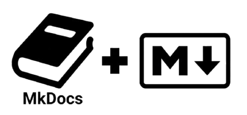

# 🤝 Contribución

### Bienvenido a la sección de **Contribución** 🚀  
Este espacio reúne toda la información necesaria para colaborar de forma ordenada: desde modificar archivos locales hasta abrir un **Pull Request (PR)** correctamente.

---

## 📌 Contenido

En este menú vas a encontrar guías relacionadas con:

- **MkDocs** 🗂️ → Estructura, navegación, previsualización y despliegue de la documentación.  
- **Markdown** ✍️ → Estilo y convenciones para mantener consistencia en los documentos.  

---

## 📖 Objetivo

El objetivo de esta sección es que cualquier programador pueda:

- ✅ Comprender la estructura del proyecto (docs, rutas, assets).  
- ✅ Editar y extender la documentación sin generar conflictos.  
- ✅ Aplicar buenas prácticas de formato y versionado.  
- ✅ Contribuir a través de PRs siguiendo un flujo claro.  

---

!!! note "💡 **Nota técnica**"
    

     No hace falta experiencia avanzada en MkDocs o Markdown.  
         Con las guías incluidas vas a poder levantar el entorno, modificar la documentación y contribuir desde el primer día.  
    

---

## 🚦 Workflow sugerido

1. Clonar el repositorio y crear una rama (`feature/nueva-seccion` o `fix/typo`).  
2. Revisar la sección de **MkDocs** para levantar el entorno y validar cambios en local.  
3. Seguir las convenciones de **Markdown** para escribir o modificar contenido.  
4. Confirmar que todo funciona y enviar el **Pull Request**. 🎉  

---
