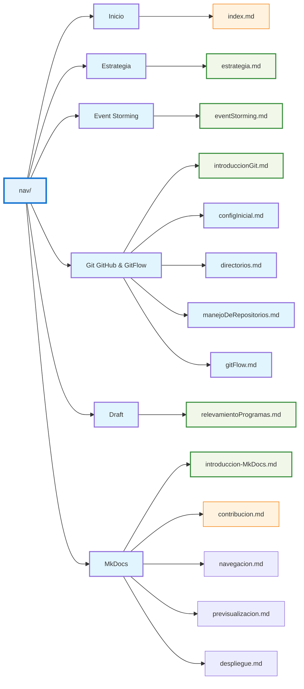

# Navegación en MkDocs 📚

---

En **MkDocs**, la navegación se define en el archivo de configuración **`mkdocs.yml`** mediante la clave **`nav`**.  
Esta sección permite organizar los menús y submenús de la documentación, mostrando los archivos **`.md`** en una estructura jerárquica.

---

!!! note "Tip de navegación"
    Cada elemento de `nav` puede ser un archivo Markdown o un submenú con otros archivos.  
    Esto permite tener un menú ordenado y fácil de explorar para los usuarios.

---

```yaml
nav:
  - Inicio: index.md
  - Estrategia: estrategia/estrategia.md
  - Event Storming: estrategia/eventStorming.md
  - Git, GitHub & GitFlow: 
    - Introduccion: git/introduccionGit/introduccionGit.md
    - Configuracion Inicial: git/configInicial/configInicial.md
    - Directorios: git/directorios/directorios.md
    - Manejo de Repositorios: git/manejoDeRepositorios/manejoDeRepositorios.md
    - Git Flow: git/gitFlow/gitFlow.md
  - Draft: 
    - Relevamiento de Programas: draft/relevamientoProgramas/relevamientoProgramas.md
  - MkDocs:
      - Introducción: mkDocs/MkDocs/Introduccion/introduccion-MkDocs.md
      - Contribución: mkDocs/MkDocs/Contribucion/contribucion.md
      - Navegación: mkDocs/MkDocs/Navegacion/navegacion.md
      - Previsualización: mkDocs/MkDocs/Previsualización/previsualizacion.md
      - Despliegue: mkDocs/MkDocs/Despliegue/despliegue.md
```

---
<div>

</div>
---

!!! tip
    Con esta configuración, <b>MkDocs</b> genera automáticamente un menú lateral o superior (dependiendo del tema) con la estructura definida en `nav`.

<br>
