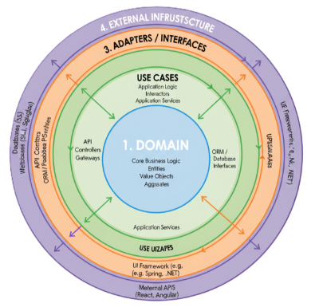

# 🧩 Clean Architecture

En todos nuestros desarrollos aplicamos los principios de **Arquitectura Limpia (Clean Architecture)** para mantener la **independencia tecnológica**, la **escalabilidad** y la **calidad del software**.  
Esto garantiza que nuestras soluciones puedan evolucionar sin depender de una tecnología específica.

---

??? Question "¿En qué se basa?"
    La **Clean Architecture** divide el sistema en **capas con responsabilidades claras**.  
    Cada capa depende solo de las más internas, lo que asegura que los cambios externos —como frameworks, bases de datos o interfaces— **no afecten la lógica del negocio**.

---

## 🏗️ Estructura de Nuestra Arquitectura

Nuestros proyectos están organizados en **cuatro niveles esenciales**, que separan la lógica, la aplicación, las interfaces y la infraestructura:

| 🏛️ Capa | ⚙️ Descripción | 💬 Ejemplo |
|----------|----------------|-------------|
| **Dominio (Lógica de Negocio)** | Contiene las reglas y entidades centrales del sistema. No depende de frameworks ni bases de datos. | Validaciones como “un usuario debe tener más de 18 años”. |
| **Casos de Uso (Aplicación)** | Define las acciones que puede ejecutar el sistema (registrar usuario, generar reporte, etc.). Se apoya en el dominio, pero sin depender de tecnología externa. | Flujo de registro o generación de un reporte. |
| **Adaptadores (Interfaces)** | Actúan como traductores entre el mundo interno y externo (controladores HTTP, mappers, vistas, etc.). | Un controlador que transforma datos de una API a objetos del dominio. |
| **Infraestructura (Tecnología Externa)** | Contiene todo lo dependiente de tecnología externa: bases de datos, frameworks, APIs, librerías, etc. | Base de datos PostgreSQL, frameworks como Express o Next.js. |

---

## 🚀 Por qué usamos Clean Architecture

**Aplicar esta arquitectura nos permite:**

✅ **Proteger la lógica de negocio** ante cambios tecnológicos.  
✅ **Escalar y mantener** proyectos grandes con facilidad.  
✅ Escribir código **independiente, testeable y flexible**.  
✅ Separar responsabilidades para **facilitar el trabajo en equipo**.

 
