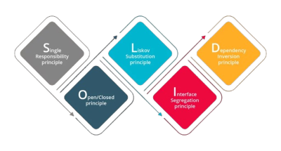

# 🧱 Principios SOLID

En nuestros proyectos, todo el código se construye siguiendo los **principios SOLID**.  
Esto nos permite mantener una base de código **ordenada, escalable y fácil de evolucionar**, sin que los cambios rompan lo que ya funciona.

!!! Success ""
    ⚙️ Aplicamos SOLID no como una regla rígida, sino como una **forma de pensar y diseñar** software limpio y duradero.
    
---

## 🧩 ¿Qué es SOLID?

**SOLID** es un conjunto de **cinco principios de diseño** que usamos para crear sistemas flexibles y mantenibles.  
Cada letra representa un pilar que guía cómo estructuramos las clases, dependencias y módulos.

| 🔤 Inicial | 🧠 Principio | 💬 En pocas palabras |
|-------------|--------------|---------------------|
| **S** | **Single Responsibility Principle** | Cada clase hace **una sola cosa**. |
| **O** | **Open/Closed Principle** | El código está **abierto a extensión, cerrado a modificación**. |
| **L** | **Liskov Substitution Principle** | Las subclases pueden **reemplazar** a las clases base sin romper nada. |
| **I** | **Interface Segregation Principle** | **Interfaces pequeñas**, enfocadas y sin métodos innecesarios. |
| **D** | **Dependency Inversion Principle** | Los módulos **dependen de abstracciones**, no de implementaciones concretas. |

---

!!! tip "Cómo lo aplicamos en nuestros desarrollos"
    Usamos SOLID como un **estándar interno de calidad**.  
    Esto nos permite construir sistemas que se adaptan al cambio sin perder estabilidad.

### 🚀 Beneficios reales

✅ **Módulos claros:** cada componente tiene un propósito definido.  
✅ **Cambios seguros:** nuevas features sin romper lo existente.  
✅ **Código legible:** cualquier dev entiende la lógica en minutos.  
✅ **Reutilización:** más trabajo en equipo, menos código repetido.  
✅ **Escalabilidad natural:** los proyectos crecen sin volverse caóticos.
