```mermaid
sequenceDiagram
    participant Dev as 💻 Desarrollador local
    participant Git as 🐙 GitHub
    participant Enc as 👨‍💼 Encargado
    participant Act as ⚙️ GitHub Action
    participant Page as 🌐 GitHub Pages

    %% 1. Actualización local desde GitHub
    Dev->>Git: git checkout develop<br>git pull develop
    Git-->>Dev: Trae actualizaciones de la rama develop

    %% 2. Merge local
    Dev-->>Dev: git merge feature/...

    %% 3. Subida de cambios
    Dev->>Git: git push origin develop<br>(Sube la rama actualizada)

    %% 4. PR y revisión
    Git->>Enc: Solicitar Pull Request develop → main
    Enc->>Git: Revisión y aprobación del PR

    %% 5. Build y despliegue
    Git->>Act: Ejecutar acción de build MkDocs
    Act->>Page: Publicar documentación actualizada
    Page-->>Dev: 🚀 Sitio disponible en línea
```

# 🚀 Despliegue de Documentación con MkDocs + GitHub Pages

Cada vez que se actualiza la documentación, el proceso de despliegue ocurre de forma automática usando **GitHub Actions** y **GitHub Pages**.  
El flujo es simple: el desarrollador trabaja en `develop`, solicita revisión, y el encargado aprueba el **Pull Request** hacia `main`.  
A partir de ahí, el despliegue ocurre solo, sin necesidad de ejecutar comandos manuales.
---

## 🧠**Pasos**
!!! tip "" 
    <b>1.</b> El desarrollador trabaja y sube los cambios a develop.  
    <b>2.</b> Pide un Pull Request al encargado.  
    <b>3.</b> El encargado revisa y aprueba el merge hacia main.  
    <b>4.</b> GitHub Actions construye la web con MkDocs.  
    <b>5.</b> GitHub Pages publica automáticamente la nueva versión.  

---

---

### 💻 <b>Flujo de Pull Request en GitHub</b>

!!! bug ""
    En este video se muestra el proceso de creación de un Pull Request desde la rama develop hacia main en GitHub. Se visualizan los cambios en el código, comparando las versiones anteriores con las nuevas, y cómo se integran las actualizaciones dentro del repositorio.

    
---

### 🚀 <b>Integración final del Pull Request</b>

!!! bug ""
    Una vez que no existen conflictos en el código, se puede realizar el merge del Pull Request desde develop hacia main en GitHub, integrando los cambios correctamente al proyecto.

 

