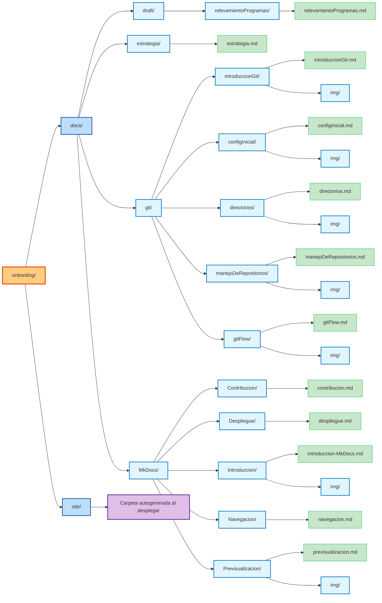

# Guía de Contribución 🚀

Todo proyecto mantiene su documentación en la carpeta **`docs/`**, organizada por áreas temáticas para facilitar la colaboración y la escalabilidad del conocimiento.  
La carpeta **`site/`** se genera automáticamente al momento de desplegar la documentación, por lo que **no debe editarse manualmente**.

---

#### | **Principios de trabajo**

!!! note "Estandarización"
    <p style="font-size: 0.75rem; line-height:1.5;">
    Cada sección está estructurada en subcarpetas, y cada una incluye al menos un archivo **`.md`** con la información relevante.
    </p>

!!! tip "Escalabilidad"
    <p style="font-size: 0.75rem; line-height:1.5;">
    Podés crear nuevas carpetas o archivos siempre que respetes la convención de nombres (`introduccion.md`).
    </p>

!!! Danger "Colaboración"
    <p style="font-size:0.75rem; line-height:1.5;">
    **Colaboración:** cada cambio debe realizarse en una **rama separada**, acompañado de un **`commit`** claro y un **`Pull Request`**.
    </p>

---

#### | **Flujo recomendado**

Seguir las prácticas de versionado documentadas en **`gitFlow`**.

!!! note
    <p style="font-size: 0.75rem; line-height:1.5;">
    Mantener consistencia con las convenciones de **`git/configInicial/configInicial.md`**.
    </p>
Documentar cambios en la carpeta correspondiente, agregando o actualizando archivos **`.md`**.

---

#### | **Importante**

!!! warning "Atención"
    <p style="font-size: 0.75rem; line-height:1.5;">
    La carpeta **`docs/`** es el único lugar editable.  
    La carpeta **`site/`** se genera al hacer el build y refleja lo que se verá en producción.
    </p>

---



---

```yaml
project/
│
├── docs/                        # Documentación (carpeta principal)
│   ├── draft/
│   │   ├── CICD/
│   │   │   └── CICD.md
│   │   ├── relevamientoProgramas/
│   │   │   └── relevamientoProgramas.md
│   │   └── draft.md
│   │
│   ├── git/
│   │   ├── configInicial/
│   │   │   ├── Gif/
│   │   │   │   └── ejemplo.gif
│   │   │   ├── img/
│   │   │   │   └── config.png
│   │   │   └── configInicial.md
│   │   │
│   │   ├── directorios/
│   │   │   ├── img/
│   │   │   │   └── ejemplo.png
│   │   │   └── directorios.md
│   │   │
│   │   ├── gitFlow/
│   │   │   ├── img/
│   │   │   │   └── gitFlow.png
│   │   │   └── gitFlow.md
│   │
│   └── README.md                # Introducción de contribución
│
└── site/                        # Carpeta autogenerada al desplegar
```