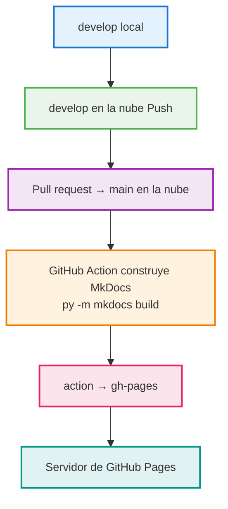
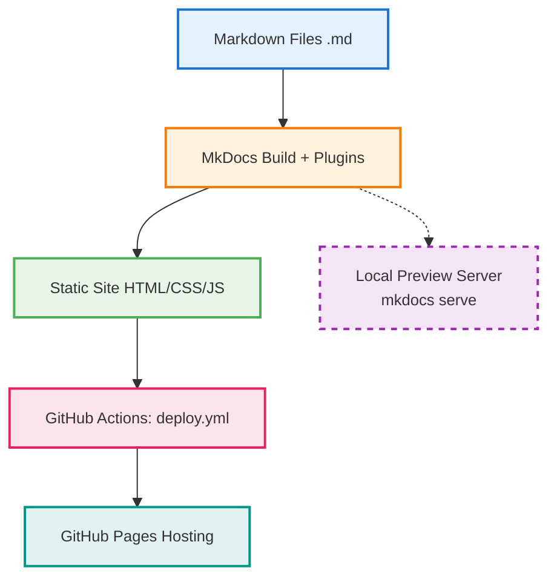

# 🚀Despliegue de Documentación con MkDocs + GitHub Pages + GitHub Actions

Este proyecto utiliza **MkDocs** para generar un sitio estático a partir de archivos Markdown, **GitHub Actions** para la construcción automática, y **GitHub Pages** para publicar el contenido.

---

## 📁 Estructura del proyecto

```yaml
├── docs/                    # Archivos fuente en Markdown
├── .github/
│   └── workflows/
│       └── deploy.yml       # GitHub Action para deploy automático
├── mkdocs.yml               # Configuración de MkDocs
```

---

## 🛠️ Flujo de trabajo
<div>

</div>
---

## 🤖GitHub Action (deploy.yml)

<div>
```yaml
name: Deploy MkDocs site                          # Nombre del workflow que aparece en GitHub Actions

on:                                               # Define cuándo se ejecuta el workflow
  push:                                           # Se ejecuta cuando hay un push
    branches:
      - main                                      # Solo cuando el push es a la rama "main"

permissions:                                      # Permisos que necesita el workflow
  contents: write                                 # Permite escribir en el repositorio (crear la rama gh-pages)

jobs:                                             # Define los trabajos a ejecutar
  deploy:                                         # Nombre del job
    runs-on: ubuntu-latest                        # Máquina virtual Ubuntu donde se ejecuta

    steps:                                        # Lista de pasos a ejecutar
      - name: Checkout code                       # Paso 1: Descargar el código del repo
        uses: actions/checkout@v3                 # Action oficial para descargar código

      - name: Setup Python                       # Paso 2: Configurar Python
        uses: actions/setup-python@v4            # Action oficial para instalar Python
        with:
          python-version: '3.x'                  # Versión de Python (la más reciente 3.x)

      - name: Install dependencies               # Paso 3: Instalar dependencias
        run: |                                   # Ejecuta múltiples comandos
          pip install mkdocs                     # Instala MkDocs base
          pip install mkdocs-material            # Instala tema Material
          pip install mkdocs-awesome-pages-plugin # Instala plugin para páginas
          # agregar acá más plugins si se usan 

      - name: Build site                         # Paso 4: Construir el sitio
        run: mkdocs build --clean                # Genera el sitio en carpeta ./site/ (--clean borra build anterior)

      - name: Deploy to GitHub Pages             # Paso 5: Desplegar a GitHub Pages
        uses: peaceiris/actions-gh-pages@v3     # Action de terceros especializada en GitHub Pages
        with:
          github_token: ${{ secrets.GITHUB_TOKEN }} # Token automático de GitHub para autenticación
          publish_dir: ./site                   # Carpeta que contiene el sitio generado
```
</div>
---

## 🧪 Verificar
**1.** En GitHub, ir a `Settings > Pages`
**2.** Asegurarse que:
* Branch: `gh-pages`
* Carpeta: `/ (root)`
3. Acceder al sitio en:
`https://<nombre-usuario>.github.io/<nombre-repo>`

---
